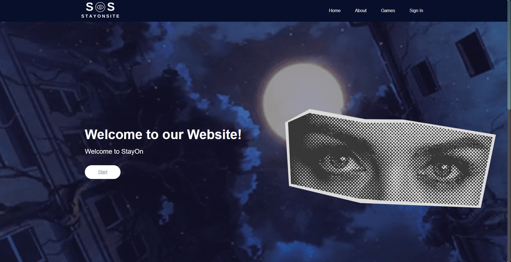
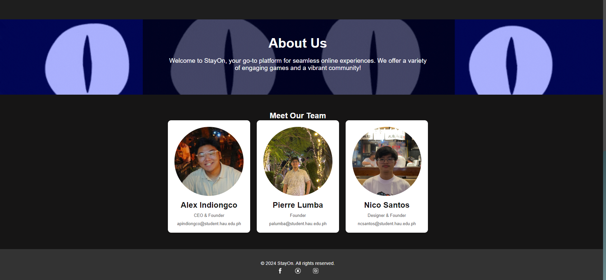

# StayOn.Site

**Cloud Computing Finals Project**

- **Started:** October 1, 2024  
- **Submitted:** October 24, 2024

## Project Overview

StayOn.Site is a website developed as a final project for the Cloud Computing course under Professor Ulysses Raymond F. Monsale. The project integrates core and advanced cloud concepts taught by Professor Ulysses and AWS Cloud Academy, demonstrating skills acquired in web development and cloud deployment.

## Team Members

- **Alex Andhrei Indiongco**
- **Pierre Ellezar Lumba**
- **Nicolai Isaiah Santos**

---

## Screenshots

### Home Page

### About Us Page

